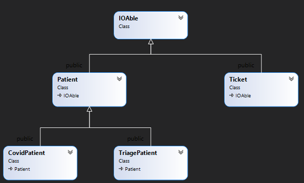

 # Project: General Hospital Pre-Triage Application
- [MS1 V1.0](#milestone-1)
- [MS2 V1.0](#milestone-2)
- [MS3 V1.1](#milestone-3)<br />
V1.1: corrected minor problem in ms3tester.
- [MS4 V1.1](#milestone-4)<br />
Corrected typo in csvRead, changed ~~ostream~~ to istream [Here](#csvread-virtual-function-override) and [Here](#the-csvread-virtual-function-override) 
- [MS5 V0.92 (Final Milestone)](#milestone-5)<br />
  [0.91 submission details](#ms5-submission-and-the-due-date)<br/>
  [0.92 initialization sample](#pretriage-constructor) 

Because of the pandemic and prevention of the spread of COVID19, hospitals need to screen the patients and separate those in need of COVID-test from others. This has to be done in an orderly fashion by letting the patients know what is the expected wait time and let them know when they can be admitted. 

Your task is to help complete the implementation of the Pre-Triage application. 

## The Pre-Triage Application
The application starts by displaying a simple menu with three options:
```Text
General Hospital Pre-Triage Application
1- Register
2- Admit
0- Exit
>
```
### Register
The register option is selected to screen patients before getting into the hospital. The user can select between a COVID Test or Triage.

COVID test is selected if the patient is at the hospital for a COVID Test. In this case, the patient's name and OHIP number is entered and then a ticket will be printed with a call number and estimated time of admission for the patient.

If Triage is selected then in addition to the patient's name and OHIP number, the symptoms of the patient are entered. Then a ticket for Triage is printed with an estimated time of admission.

### Admit
Admit is selected when the COVID Test area or the Triage section is ready to accept a patient. After selecting COVID or Triage, the patient with the next ticket in line will be called. Based on the time of the call, the average wait time for the next patient for that line up (COVID or Triage) will be updated.

## Milestones and due dates
The project will be done in 4 or 5 milestones and each milestone will have its due date. The due date of each milestone will be announced when it is published, and it is based on the amount of work to be done for that milestone. 

## Citation, Sources

When submitting your work, all the files submitted should carry full student information along with the "citation and sources" information. See the following example:

```C++
/* Citation and Sources...
Final Project Milestone ? 
Module: Menu
Filename: Menu.h
Version 1.0
Author	John Doe
Revision History
-----------------------------------------------------------
Date      Reason
2020/?/?  Preliminary release
2020/?/?  Debugged DMA
-----------------------------------------------------------
I have done all the coding by myself and only copied the code 
that my professor provided to complete my workshops and assignments.
-----------------------------------------------------------
OR
-----------------------------------------------------------
Write exactly which part of the code is given to you as help and 
who gave it to you, or from what source you acquired it.
-----------------------------------------------------------*/
```

## Compiling and Testing Your Program

All your code should be compiled using this command on `matrix`:

```bash
g++ -Wall -std=c++11 -g -o ws file1.cpp file2.cpp ...
```

- `-Wall`: compiler will report all warnings
- `-std=c++11`: the code will be compiled using the C++11 standard
- `-g`: the executable file will contain debugging symbols, allowing *valgrind* to create better reports
- `-o ws`: the compiled application will be named `ws`

After compiling and testing your code, run your program as following to check for possible memory leaks (assuming your executable name is `ws`):

```bash
valgrind ws
```

To check the output, use a program that can compare text files.  Search online for such a program for your platform, or use *diff* available on `matrix`.

> Note: All the code written in the project must be implemented in the **sdds** namespace.

## Project Implementation notes:  *Very Important, read carefully*
-	All the code written in this project should be within the namespace sdds.
-	You are free and encouraged to add any member variables or member functions you find necessary to complete your code. If you are not sure about your strategy for adding functionalities and properties to your classes, ask your professor for advice.  
-	A module called **utils** is added to the project with two functions that can be used in your implementation. As mentioned before, you can add any custom code of your own to the **utils** module to be used throughout the project. Also, because the application works with real system time, for debugging purposes a global **sdds::debug** flag is added to the utils module. (see Time module for more information)<br/>
You are free to use this flag for your own debugging messages.
 **utils.h** will be included in all the testers of the milestones. 
-	Unless you are asked for a specific definition, name the variables, and functions yourself. Use proper names and follow the naming conventions instructed by your professor. Having meaningless and misleading names will attract a penalty.
-	Throughout the project, if any class is capable of displaying or writing itself, the member function will always have the following signature: 
The function will return a reference of an **ostream** and will receive a reference of an "ostream" as an argument.  
-	Throughout the project, if any class is capable of reading or receiving its content from a stream, the member function will always have the following signature: 
The function will return a reference of an **istream** and will receive a reference on an **istream** as an argument.  
-	When creating methods (member functions) make sure to make them constant if in their logic, they are not modifying their class.
-	When passing an object or variable by address or reference, if they are not to be modified, make sure they are passed as constant pointers and references.
-	If an Empty state is required for an object, it is considered to be an “invalid” empty state, and objects in this state should be rendered unusable.

# Milestone 1 

## Time Module
The time module is designed to:
- read and write time.
- measure the passage of time
- calculate the estimated wait time

The time module only holds the time in minutes but will display and read the time in the following format:  
```Text
HH:MM
```
For example, when the Time object holds the value 125, it will display **02:05**. Likewise if the time **13:55** is read by the Time object from a stream, **835** is stored in the object (i.e. 13x60+55). Note that since the Time object is also used for the passage of time, there is no limit to the number of minutes and it may pass 24 hours if needed.  
> Note: **125:15** is a valid time that means **125** hours and **15** minutes also **0:96** is a valid entry and it is displayed as: **01:36** that is **1** hour and **36** minutes

Complete the implementation of the Time class with the following mandatory specs:  

```C++
  class Time {
      unsigned int m_minutes ;      // holds time in minutes 
   public:
      void reset();  
      Time(unsigned int min = 0); 
      std::ostream& write(std::ostream& ostr) const;
      std::istream& read(std::istream& istr);
      operator int()const;
      Time& operator *= (int val);
      Time& operator-=(const Time& D);
   };
```
```C++
Time& reset();  
```
Resets the **Time** to the current time using **sdds::getTime()** (available in **utils** module) and then returns the reference of the current object.
> Note that if the **sdds::debug** is set to true, the **getTime()** function will receive the time from the user instead. This will be used for debugging purposes and when submitting your work through the submitter program.
```C++
Time(unsigned int min = 0); 
```
Constructs the Time by setting the number of minutes held in the object or set the time to zero by default.
```C++
std::ostream& write(std::ostream& ostr) const;
```
Writes the time into a stream in HH:MM format padding the spaces with zero if
the numbers are single digit (examples   03:02, 16:55  234:06 )
```C++
std::istream& read(std::istream& istr);
```
Reads the time form a stream in H:M format. It makes sure that the two integers (hours and minute) are separated by ":", otherwise it will set the **istream** object in a failure state. (see the steps below to see how)

Note that this function does not react to any invalid data. It simply follows these steps:
- reads the integer for the hours using **istr**
- reads one character and makes sure it is **':'**, if it is not is will set the **istream** object a failure state by issuing this command: ```istr.setstate(ios::failbit);```
- reads the integer for the minutes using **istr**

> Note: Do not clear or flush the **istream** since this method complies with the **istream** standards. The caller of this function may check the **istream** state to make sure that the read was successful if needed.

```C++
operator int()const;
```
if time is casted to an integer, it will return the number of minutes.
```C++
Time& operator*= (int val);
```
Multiplies the Time by **val**, then returns the reference of the current object.
```C++
Time& operator-= (const Time& D);
```
Calculates the time difference between the current time and the incoming argument Time **D**. Note that the difference can never be a negative value:<br/>
23:00 -= 9:00 will be **14:00**.<br />
18:00 -= 16:00 will be **2:00**.<br />
1:00 -= 22:00 will be **3:00**.  ((**1:00** + 24:00) - **22:00**)<br /> 
See the illustration below:


```C++
operator<<
```
Overload the insertion operator to be able to insert a Time object into an ostream object 
```C++
operator>>
```
Overload the extraction operator to be able to extract data from an istream object into the Time object

## timeTester.cpp execution sample
```Text
E: 00:00
D: 23:05
C: 01:05
  D        C     D-=C
23:05 -= 01:05 = 22:00
  C        D     C-=D
01:05 -= 22:00 = 03:05
C: 03:05
 C *= 2
06:10
 C *= 12
74:00
Please enter the time (HH:MM): 22:33
you entered: 22:33
Enter current time: 12:00
12:00
Actual system time is: 01:15  
```
> Note: the last value **01:15** changes based on the system's time.
## Menu Module
Menu class encapsulates a menu and provides selection functionality for the caller program.

```C++
 class Menu{
      char* m_text; // holds the menu content dynamically
      int m_noOfSel;  // holds the number of options displayed in menu content
   public:
      Menu(const char* MenuContent, int NoOfSelections);
      virtual ~Menu();
      std::ostream& display(std::ostream& ostr = std::cout)const;
      int& operator>>(int& Selection);
   };
```

```C++
 Menu(const char* MenuContent, int NoOfSelections);
```
Dynamically allocates memory to hold the content pointed by **m_text**. Also keeps the number of Selections in **m_noOfSel**.
```C++
 ~Menu();
```
Deallocates the dynamically allocated memory.
```Text
Copy and assignment
```
Makes sure the Menu can not be copied or assigned to another Menu.  object
```Text
display
```
Displays the Menu content and then in a new line, it displays:

```Text
0- Exit
> _
```
```C++
int& operator>>(int& Selection);
```
The member insertion operator first calls the display function and then receives the user's selection as an integer value. The integer reference **selection** argument is then set to this value and returned.<br />
Make sure that the entered value is validated as an integer and also the value should be between 0 and **m_noOfSel**.<br />
If the above conditions are not met, a proper error message should be displayed and re-entry requested(see below)

Assuming that the menu content is set to:```"Tester Options menu:\n1- Option one\n2- Option two\n3- Option three"``` and the number of selections is set to 3 the **operator>>** should run like this:
```Text
Tester Options menu:
1- Option one
2- Option two
3- Option three
0- Exit
> abc
Bad integer value, try again: -1
Invalid value enterd, retry[0 <= value <= 3]: 4
Invalid value enterd, retry[0 <= value <= 3]: 2
```
## menuTester.cpp execution sample
```Text
Tester Options menu:
1- Option one
2- Option two
3- Option three
0- Exit
> -1
Invalid value enterd, retry[0 <= value <= 3]: 4
Invalid value enterd, retry[0 <= value <= 3]: abc
Bad integer value, try again: 2
option two selected

Tester Options menu:
1- Option one
2- Option two
3- Option three
0- Exit
> 1
option one selected

Tester Options menu:
1- Option one
2- Option two
3- Option three
0- Exit
> 3
option three selected

Tester Options menu:
1- Option one
2- Option two
3- Option three
0- Exit
> 0
goodbye!
```
## ms1Tester.cpp Execution Sample 
> Use these data entry for your submission.
```Text
Menu tester -----------------------------------------
Tester Options menu:
1- Option one
2- Option two
3- Option three
0- Exit
> -1
Invalid value enterd, retry[0 <= value <= 3]: 4
Invalid value enterd, retry[0 <= value <= 3]: abc
Bad integer value, try again: 2
option two selected

Tester Options menu:
1- Option one
2- Option two
3- Option three
0- Exit
> 1
option one selected

Tester Options menu:
1- Option one
2- Option two
3- Option three
0- Exit
> 3
option three selected

Tester Options menu:
1- Option one
2- Option two
3- Option three
0- Exit
> 0
goodbye!
Time tester -----------------------------------------
E: 00:00
D: 23:05
C: 01:05
  D        C     D-=C
23:05 -= 01:05 = 22:00
  C        D     C-=D
01:05 -= 22:00 = 03:05
C: 03:05
 C *= 2
06:10
 C *= 12
74:00
Please enter the time (HH:MM): abc
Bad time entry, retry (HH:MM): 12.33
Bad time entry, retry (HH:MM): 12:33
you entered: 12:33
Enter current time: 12:00
12:00
Actual system time is: 01:15
```
> Note: the last value **01:15** changes based on the system's time.

## MS1 Submission and due date
Milestone 1 is due on Friday Nov 13th, 23:59.

Upload your source code and the tester program (**utils.cpp, utils.h Menu.cpp,Menu.h, Time.cpp, Time.h and ms1Tester.cpp**) to your `matrix` account. Compile and run your code using the `g++` compiler as shown above and make sure that everything works properly.

Then, run the following command from your account (replace `profname.proflastname` with your professor’s Seneca userid):
```
~profname.proflastname/submit 244/prj/m1
```
and follow the instructions.

> **:warning:Important:** Please note that a successful submission does not guarantee full credit for this workshop. If the professor is not satisfied with your implementation, your professor may ask you to resubmit. Re-submissions will attract a penalty.

# Milestone 2  
## IOAble interface module

In milestone 1 we have created the utility classes needed to have the menu selection and Time display and calculations.<br />
Now we need to create the core classes of the application.  The diagram below displays the core classes of the application and their relationship.



Create a class called **IOAble**.  This class is an interface and enforces input and output methods to its derived classes.<br />
The IOAble class has only 4 pure virtual functions:

## Pure Virtual Functions:
### csvWrite
This pure virtual function is for future comma-separated ostream outputs.
It receives a reference of an ostream and returns a reference of an ostream. This function is incapable of changing the current object.  
### csvRead
This pure virtual function is for future comma-separated istream input.
It receives a reference of an istream and returns a reference of an istream.
### write
This pure virtual function is for future ostream outputs.
It receives a reference of an ostream and returns a reference of an ostream. This function is incapable of changing the current object.
### read
This pure virtual function is for future istream inputs.
It receives a reference of istream and returns a reference of an istream.
### virtual destructor
This class also has an empty virtual destructor.

## Insertion and Extraction helper operator overloads.
### operator<<
Overload the insertion operator to be able to insert the information of an IOAble object into ostream using the IOAble::write function.
### operator>>
Overload the extraction operator to be able to extract information from an istream into an IOAble object using the IOAble::read function.

## The tester program.
Read and study the tester program and understand how it works.  It is a very good example to show how an interface is used as a base class.  It also can help you in the development of the upcoming milestones.

## ms2Tester.cpp Execution Sample 
> Use these data entries for your submission.
```Text
defaulting Box
Getting information of an IOAble box from console:
Height: 5<Enter>
Width: 30<Enter>
Display the IOAble box on console:
************************************************************
************************************************************
************************************************************
************************************************************
************************************************************

Saving 5,30 in the output file.
Dynamically allocating a Box and holding it in an IOAble pointer...
defaulting Box
Reading dimenstions from file using the IOAlbe pointer
Dimentions:
5,7
What it looks like on screen:
**************
**************
**************
**************
**************

Now save it in the file...
Reading the next dimenstions from file using the IOAble pointer
Dimentions:
7,4
What it looks like on screen:
********
********
********
********
********
********
********

Save this one in the output file too...
Close the file and display it...
boxesOut.txt---------------------
5,30
5,7
7,4
---------------------------------
Removing the box from memory using the IOAble pointer...
Box(7,4) is gone!
Content of "boxesOut.txt" file
boxesOut.txt---------------------
5,30
5,7
7,4
---------------------------------
Box(5,30) is gone!

```


## MS2 Submission and the due date
Milestone 2 is due on Sunday, Nov 15th, 23:59.

Upload your source code and the tester program (**IOAble.cpp, IOAble.h, ms2Tester.cpp**) to your `matrix` account. Compile and run your code using the `g++` compiler as shown above and make sure that everything works properly.

Then, run the following command from your account (replace `profname.proflastname` with your professor’s Seneca userid):
```
~profname.proflastname/submit 244/prj/m2
```
and follow the instructions.

> **:warning:Important:** Please note that a successful submission does not guarantee full credit for this workshop. If the professor is not satisfied with your implementation, your professor may ask you to resubmit. Re-submissions will attract a penalty.

# Milestone 3

## The Ticket Module (implementation provided)

The Ticket class encapsulates a Ticket to be given to the patients when they arrive. Read the code, understand it, and use the logic and the functionalities throughout the project. 

```C++
#ifndef SDDS_TICKET_H_
#define SDDS_TICKET_H_
#include "Time.h"
#include "IOAble.h"
namespace sdds {
   class Ticket:public IOAble{
      Time m_time;  
      int m_number;
   public:
      Ticket(int number);
      operator Time()const;
      int number()const;
      void resetTime();
      std::ostream& csvWrite(std::ostream& ostr)const;
      std::istream& csvRead(std::istream& istr);
      std::ostream& write(std::ostream& ostr )const;
      std::istream& read(std::istream& istr);
   };
}
#endif // !SDDS_TICKET_H_
```
### Member Variables
#### Time m_time;
The time the Ticket was issued
#### int m_Number;
The ticket number; A sequential integer, starting from one and unique for each lineup.
### Member functions and constructor
#### Ticket(int number);
Constructs a Ticket by setting the **m_number** member variable
#### operator Time()const;
When Ticket is casted to **Time** it will return the **m_time**
#### int number()const;
A query returning the number of the ticket
#### void resetTime();
Sets the Ticket time to the current time.
### Virtual function overrides
#### csvWrite
Inserts comma-separated ticket number and time into ostream.
#### csvRead
Extracts the ticket number and time in a comma-separated format from istream.
#### write
Inserts a ticket into the ostream to be displayed on the console.
#### read
Extracts the ticket information from istream.  This function works the same as csvRead. 

## The Patient Module

Create an abstract IOAble patient class (the patient class is a derived class from IOAble).  The patient class is responsible to encapsulate a general patient arriving at the hospital.  In later designs (MS4) the patient class will be inherited into a COVID test patient and a triage patient.  

The following are the mandatory properties of the patient class.

### Member Variables and Objects
#### the patient name
A character pointer variable to hold the name of the patient in a Cstring dynamically.
#### the OHIP number
An integer to hold the OHIP insurance number (exactly 9 digits) of the patient.
#### the ticket
A **Ticket** object to hold the ticket of the patient for the lineup.
#### the file IO flag
A Boolean flag. This flag will be set to **true** if the patient object is to be written into or read from a **file** (comma separated value), otherwise, this flag will be set to **false** if the patient object is to be written on or read from the **console**.

### Constructor and destructor
A patient can be instantiated using a ticket number (an integer) and a file IO flag (a Boolean).  The ticket number is used to initialize the member [ticket object](#the-ticket). The file IO is used to initialize the member [file IO flag](#the-file-io-flag). 
When a patient has instantiated it, If the file IO flag is not provided the default value **"false"** is passed also if the ticket number is not provided the default value **zero (0)** is passed.

### Copying and assignment.
A patient cannot be copied or assigned to another patient; 

### Destructor
The destructor of the patient will deallocate the dynamically allocated [patient name Cstring](#the-patient-name).

### Member functions
#### Pure Virtual Function type()
Create a pure virtual function called **type** that returns a character and is incapable of modifying the current object.
In future derived objects, this function will return a single character that identifies the type of the patient (COVID test patient or Triage patient).

#### FileIO query and modifier
##### fileIO query
Create a query called fileIO that returns the member [file IO flag](#the-file-io-flag).  This query is incapable of modifying the current object.
##### fileIO modifier
Create a modifier member function called fileIO that receives a Boolean value to set the member [fileIO flag](#the-file-io-flag).

#### operator== overloads
##### character comparison
Overload the operator== to compare the current object with an incoming single character and return true if the single character is the same as the return value of [the pure virtual type member function](#pure-virtual-function-type).  This operator receives a single character and returns true or false and can not modify the current object.
##### comparing to another patient
Overload the operator to compare the current object to another patient and return true if the type of the current patient is the same as the type of the other patient.
This operator receives a constant reference of a patient object, and returns true or false, and can not modify the current object.

#### setArrivalTime function
Sets the time of the ticket of the patient to the current time.
This function neither receives nor returns any value.

#### Time cast operator overload
If the patient is casted to the Time type it should return the time of the ticket.
This cast overload can not modify the current object.

#### number
Create a query function called **number** that returns the number of the ticket.
This function can not modify the current object.

### pure virtual function overwrites.
#### csvWrite
Inserts the following values into the ostream in a comma-separated format.  After the values are inserted it will insert a single "comma", and then call the csvWrite function of the member [ticket object](#the-ticket) and return the ostream.

Here is the sequence of the values inserted into ostream
```Text
returned value of type() function
','
name of the patient
','
OHIP number
','
```
then it will call the csvWrite function of the member [ticket object](#the-ticket).

#### csvRead
The csvRead function extracts all the values in the same order as the csvWrite function, except for the type.<br />
Start the extraction with the name of the patient as follows: 
- In a local Cstring of 51 characters extract the name of the patient from istream up to a comma character. 
- Copy the extracted name into a dynamically allocated memory pointed by the name member variable.  *Make sure that the name pointer is deleted before the allocation to guarantee there is no memory leak.* 
- then extract and ignore all the characters up to and including a comma character. (use istream's ignore)
- then extract an integer from istream into the OHIP member variable.
- Finally, end the extraction by calling the csvRead of the member [ticket object](#the-ticket).
- return the istream reference at the end.

#### write
Inserts the patient information into the ostream to be displayed on the console.
- insert  the member [ticket object](#the-ticket into ostream
- go to newline
- insert the name
- insert ```", OHIP: "```
- insert the OHIP number number
- return the ostream

#### read
Extracts the ticket information from the console using istream as follows:
- Prompt: ```"Name: "```
- In a local Cstring of 51 characters extract the name of the patient from istream (using istream's get) up to newline.
- Copy the extracted name into a dynamically allocated memory pointed by the name member variable.  *Make sure that the name pointer is deleted before the allocation to guarantee there is no memory leak.* 
- then extract and ignore all the characters up to and including the newline character. (use istream's ignore)
- Prompt: ```"OHIP: "```
- extract the 9 digit OHIP number from istream; validate it and make sure it is 9 digits(100000000 < OHIP#< 999999999). Use the same error messages used for the Menu item selection. 
- return the istream reference at the end.

Execution example:  
```Text
Name: John Doe
OHIP: abc
Bad integer value, try again: 100
Invalid value enterd, retry[100000000 <= value <= 999999999]: 123123123
```

## The tester program.
Read and study the tester program and understand how it works. 

## ms3Tester.cpp Execution Sample 

> Use these data entries for your submission.

```Text
Enter The following:
-------------------
John Doe
abc
100
123123123
12:34
-------------------
Name: John Doe
OHIP: abc
Bad integer value, try again: 100
Invalid value enterd, retry[100000000 <= value <= 999999999]: 123123123
Enter current time: 12:34
Sections 1 and 2 should match:

1- Your output on screen:
Ticket No: 24, Issued at: 12:34
John Doe, OHIP: 123123123
2- The output should be :
Ticket No: 24, Issued at: 12:34
John Doe, OHIP: 123123123

1- Your comma separated ouput:
W,John Doe,123123123,24,12:34
2- comma separated ouput should be:
W,John Doe,123123123,24,12:34

Enter the following:
>Jo Lee,234234234,200,12:50
>Jo Lee,234234234,200,12:50
Sections 1 and 2 should match:

1- Your output on screen:
Ticket No: 200, Issued at: 12:50
Jo Lee, OHIP: 234234234
2- The output should be:
Ticket No: 200, Issued at: 12:50
Jo Lee, OHIP: 234234234

Testing File IO:
1 -----------------------------------------------
Ticket No: 10, Issued at: 12:50
David Mason, OHIP: 111111111

2 -----------------------------------------------
Ticket No: 11, Issued at: 12:51
Nick Gilmour, OHIP: 222222222

3 -----------------------------------------------
Ticket No: 12, Issued at: 12:52
Roger Wright, OHIP: 333333333

4 -----------------------------------------------
Ticket No: 13, Issued at: 12:53
Rick Waters, OHIP: 333333333

5 -----------------------------------------------
Ticket No: 14, Issued at: 12:54
A name that is way way way way way way way way too, OHIP: 444444444

ms3out.csv-----------------------
W,David Mason,111111111,10,12:50
W,Nick Gilmour,222222222,11,12:51
W,Roger Wright,333333333,12,12:52
W,Rick Waters,333333333,13,12:53
W,A name that is way way way way way way way way too,444444444,14,12:54
---------------------------------
Testing operator== overloads:
Success!
Success!
Testing Time cast and number:
W, Ticket Time: 12:54
W, Ticket number: 14
```


## MS3 Submission and the due date

Milestone 3 is due on Friday, Nov 20th, 23:59.

Upload your source code and the tester program (**IOAble.cpp, IOAble.h,Patient.h, Patient.cpp, Ticket.h, Ticket.cpp, Time.h, Time.cpp,utils.h,utils.cpp,ms3.csv, ms3Tester.cpp**) to your `matrix` account. Compile and run your code using the `g++` compiler as shown above and make sure that everything works properly.

Then, run the following command from your account (replace `profname.proflastname` with your professor’s Seneca userid):
```
~profname.proflastname/submit 244/prj/m3
```
and follow the instructions.

> **:warning:Important:** Please note that a successful submission does not guarantee full credit for this workshop. If the professor is not satisfied with your implementation, your professor may ask you to resubmit. Re-submissions will attract a penalty.


# Milestone 4

Continue the implementation of the Pre-triage application by implementing the COVID patient and the triage patient modules. 

## The CovidPatient module
This module has one integer global variable called **nextCovidTicket** that is initialized to **one**.  This global variable will be used to determine what is the ticket number of the next COVID test Patient.  Each time a new **CovidPatient** object is created the value of the **nextCovidTicket** will be increased by **one**.  The scope of the global **nextCovidTicket** variable is only the **CovidPatient** module.

The **CovidPatient** class is publicly derived from the **Patient** class. The **CovidPatient** class does not add any member variables or properties to the **Patient** module.

The **CovidPatient** class has one **default constructor**, implements the pure virtual **type()** function and re-implements the four **read and write** functions of the base class **Patient** as follows:

### Default Constructor
The default constructor passes the **nextCovidTicket** global variable to the **constructor** of the base class **Patient** and then it will increase the value of **nextCovidTicket** global variable by **one**.

### the type() virtual function
This function only returns the character **'C'**;

### csvWrite virtual function override.
This function only calls the **csvWrite** function of the base class **Patient** and returns the **ostream** reference.

### csvRead virtual function override
First this function will call the **csvRead** function of the base class **Patient**, then it will set the **nextCovidTicket** global variable to the return value of the **number()** function of the **Patient** class plus **one**. 

Finally, it will return the ~~ostream~~ istream reference.

### write virtual function override.
If the **fileIO** member function returns **true**, it will call **csvWrite** function, otherwise it will first insert **"COVID TEST"** into the **ostream** object and goes to **newline**. Then it will call the **write()** function of the base class **Patient** and then goes to **newline**.

Then it will end the function by returning the **ostream** reference.

### read virtual function override. 
If the **fileIO** member function returns true it will call the **csvRead** function, otherwise, it will call the read function of the base class **Patient**.

Then it will end the function by returning the **istream** reference.

### Destructor
This class does not need a destructor.

## the CovidPatient Tester (CPTester.cpp) output
```Text
Testing CovidPatient:
Enter the following:
Enter current time: 12:34
Name: aaa
OHIP: 111111111
Enter current time: 12:34
Enter Patient information:
Name: aaa
OHIP: 111111111
Enter the following:
Enter current time: 12:35
Name: bbb
OHIP: 222222222
Enter current time: 12:35
Enter Patient information:
Name: bbb
OHIP: 222222222

Patients information entered:
COVID TEST
Ticket No: 1, Issued at: 12:34
aaa, OHIP: 111111111

COVID TEST
Ticket No: 2, Issued at: 12:35
bbb, OHIP: 222222222

CSV output:
C,aaa,111111111,1,12:34
C,bbb,222222222,2,12:35

Testing CSV input:
Enter the following:
>ccc,333333333,10,23:45
>ccc,333333333,10,23:45

Data entered:
COVID TEST
Ticket No: 10, Issued at: 23:45
ccc, OHIP: 333333333

Testing global ticket number variable:
Enter the following:
Enter current time: 23:55
Name: ddd
OHIP: 444444444
Enter current time: 23:55
Name: ddd
OHIP: 444444444
Patient information entered:
COVID TEST
Ticket No: 11, Issued at: 23:55
ddd, OHIP: 444444444

```

## The TriagePatient Module
This module has one integer global variable called **nextTriageTicket** that is initialized to **one**.  This global variable will be used to determine what is the ticket number of the next triage Patient.  Each time a new **TriagePatient** is created the value of the **nextTriageTicket** will be increased by **one**.  The scope of the global **nextTriageTicket** variable is only the TriagePatient module.

The **TriagePatient** class is publicly derived from the **Patient** class. The **TriagePatient** class adds only one character pointer member variable to the **Patient** module to dynamically hold the symptoms of the arriving patient for the triage centre.

The **TriagePatient** class has one **default constructor**, implements the pure virtual **type()** function and re-implements the four **read and write** functions of the base class **Patient**.  It also has a destructor to make sure the dynamically allocated memory by the symptoms character array is deleted.

### Symptoms character pointer member variable
Create a character pointer member variable to point to a dynamically allocated Cstring holding the list of the symptoms of the TriagePatient.


### Default Constructor
The default constructor initializes the character pointer member variable to null and then passes the **nextTriageTicket** global variable to the **constructor** of the base class **Patient** and then it will increase the value of **nextTriageTicket** global variable by **one**.

### the type() virtual function
This function only returns the character **'T'**;

### csvWrite virtual function override.
This function calls the **csvWrite** function of the base class **Patient** then inserts a comma (',') character into the ostream object then the symptoms of the patient. Then it returns the **ostream** reference.

### the csvRead virtual function override 
csvRead reads the TriagePatient's comma-separated information as follows:
- Deletes the memory pointed by the [symptoms member variable](#symptoms-character-pointer-member-variable)
- Calls the **csvRead** function of the base class **Patient**.
- Ignore a comma character.
- Reads the symptoms of the patient in a local Cstring character array, up to 511 characters or newline ('\n') whichever comes first.
- Allocates memory to the size of the symptoms read (pointed by the symptoms member variable)
- Copies the local Cstring into the dynamically allocated memory.
- sets the **nextTriageTicket** global variable to the return value of the number() member function of the Patient class plus one.
- returns the ~~ostream~~ istream reference.

### write virtual function override.
If the **fileIO** member function returns **true**, it will call **csvWrite** function. otherwise, it will write the TriagePatient as follows:  
- Inserts **"TRIAGE"** into the **ostream** object.
- Goes to **newline**. 
- It will call the **write()** function of the base class **Patient**.
- Goes to **newline**. 
- Inserts **"Symptoms: "** into the ostream object.
- Inserts the symptoms member variable into the ostream object.
- Goes to newline.

The function ends by returning the **ostream** reference.

### read virtual function override. 
If the **fileIO** member function returns true it will call the **csvRead** function, 
otherwise, it will do the following:
- Deletes the memory pointed by the [symptoms member variable](#symptoms-character-pointer-member-variable)
- Calls the **Read** function of the base class **Patient**.
- prints **"Symptoms: "**
- Reads the symptoms of the patient in a local Cstring character array, up to 511 characters or newline ('\n') whichever comes first and ignores the newline ('\n')
- Allocates memory to the size of the symptoms read (pointed by the [symptoms member variable](#symptoms-character-pointer-member-variable))
- Copies the local Cstring into the dynamically allocated memory.


The function ends by returning the **istream** reference.

### Destructor
Deletes the memory pointed by the [symptoms member variable](#symptoms-character-pointer-member-variable)

## The TriagePatient Tester (TPTester.cpp) output


```Text
Testing TriagePatient:
Enter the following:
Enter current time: 12:34
Name: aaa
OHIP: 111111111
Symptoms: aaa aaa aaa
Enter current time: 12:34
Enter Patient information:
Name: aaa
OHIP: 111111111
Symptoms: aaa aaa aaa
Enter the following:
Enter current time: 12:35
Name: bbb
OHIP: 222222222
Symptoms: bbb bbb bbb
Enter current time: 12:35
Enter Patient information:
Name: bbb
OHIP: 222222222
Symptoms: bbb bbb bbb

Patients information entered:
TRIAGE
Ticket No: 1, Issued at: 12:34
aaa, OHIP: 111111111
Symptoms: aaa aaa aaa

TRIAGE
Ticket No: 2, Issued at: 12:35
bbb, OHIP: 222222222
Symptoms: bbb bbb bbb

CSV output:
T,aaa,111111111,1,12:34,aaa aaa aaa
T,bbb,222222222,2,12:35,bbb bbb bbb

Testing CSV input:
Enter the following:
>ccc,333333333,10,23:45,ccc ccc ccc
>ccc,333333333,10,23:45,ccc ccc ccc

Data entered:
TRIAGE
Ticket No: 10, Issued at: 23:45
ccc, OHIP: 333333333
Symptoms: ccc ccc ccc

Testing global ticket number variable:
Enter the following:
Enter current time: 23:55
Name: ddd
OHIP: 444444444
Symptoms: ddd ddd ddd
Enter current time: 23:55
Name: ddd
OHIP: 444444444
Symptoms: ddd ddd ddd
Patient information entered:
TRIAGE
Ticket No: 11, Issued at: 23:55
ddd, OHIP: 444444444
Symptoms: ddd ddd ddd

```


## The tester program.
Read and study the tester program and understand how it works. 

## ms4Tester.cpp 

The ms4Tester program is the execution of both modules combine.

## MS4 Submission and the due date

Milestone 4 is due on Friday, Nov 27th, 23:59.

Upload your source code and the tester program (**IOAble.cpp, IOAble.h,Patient.h, Patient.cpp, Ticket.h, Ticket.cpp, Time.h, Time.cpp,utils.h,utils.cpp,CovidPatient.h,CovidPatient.cpp,TriagePatient.h, TriagePatient.cpp , ms4Tester.cpp**) to your `matrix` account. Compile and run your code using the `g++` compiler as shown above and make sure that everything works properly.

Then, run the following command from your account (replace `profname.proflastname` with your professor’s Seneca userid):
```
~profname.proflastname/submit 244/prj/m3
```
and follow the instructions.

> **:warning:Important:** Please note that a successful submission does not guarantee full credit for this workshop. If the professor is not satisfied with your implementation, your professor may ask you to resubmit. Re-submissions will attract a penalty.

# Milestone 5

Before starting your last stage of the project implementation, add the following method to the class **Time**. 

```C++
   Time Time::operator-(const Time& ROperand) {
      Time LOperand = *this;
      LOperand -= ROperand;
      return LOperand;
   }
```
This operator-overload overloads the binary minus operator between two Time objects.  This operator overload might be needed when calculating the wait time for a patient in the lineup.

Also, add the following template to **uitls.h**

```C++
   template <typename type>
   void removeDynamicElement(type* array[], int index, int& size) {
      delete array[index];
      for (int j = index; j < size; j++) {
         array[j] = array[j + 1];
      }
      size--;
   }
```
This template will be used to remove a Patient from the lineup when admitted.

## PreTriage Module

To complete the implementation of the final project, implement a module called Pre-Triage.  This module creates a lineup of patients and issues tickets for them as they arrive at the hospital.  Each patient in the lineup will be either a COVID Patient or a Triage Patient and will receive a ticket with a number that will be called when they are being admitted to either the COVID test centre or Triage Centre.

### Overview of The Triage Module execution

The module gets instantiated by loading the data file holding the patients' records that are already in the lineup. This data file is created by the PreTriage Module at exit time. This makes this module a stateful module, which means when the module exits, it saves all the patients' information into a data file so later, it can restart the application in the same state of the last execution (by loading the data file).

If the data file does not exist or it is not readable, the module assumes that this is the first time it is being executed; and no patients are in the lineup.

After loading the data, the result of the loading is reported and then the main menu of the application is displayed. See below:

If there is no data file or a data file with no Patient records:
```text
Loading data...
No data or bad data file!

General Hospital Pre-Triage Application
1- Register
2- Admit
0- Exit
>
```
If there is a data file with patient lineup records:
```text
Loading data...
16 Records imported...

General Hospital Pre-Triage Application
1- Register
2- Admit
0- Exit
>
```
The user can then select either register or admit.

> **Register**: This option is selected when a patient arrives at the hospital. Afterwards, the program will display another menu to select the type of Patient and receives the patient's information. The Patient is then added to the lineup and a ticket is printed. 

> **Admit**: This option is selected when either the COVID or Triage centre is ready to accept the next patient. Afterwards, the program will display another menu to select the type of the Patient and shows the information of the next patient in line. 

> **Exit**: When this option is selected, the program exits saving the information of the patients in the lineup.  

The program will load this data file the next time it starts. See below:

```text
Saving Average Wait Times,
   COVID Test: 00:05
   Triage: 00:07
Saving lineup...
1- C,Apu Nahasapeemapetilon,684689164,18,01:04
2- T,Barney Gumble,350158143,12,01:10,Nausea-Vomiting-Abdominal Pain
3- T,Murphy Prince,763006002,13,01:18,Pounding headache
4- C,Chief Clancy Wiggum,448762564,19,01:26
5- C,Dewey Largo,712691397,20,01:34
6- C,Eddie,547723561,21,01:42
7- T,Edna Krabappel,435676529,14,01:50,Muscle tension-Nausea-Photosensitivity
8- T,Itchy,253789913,15,01:58,Chest Pain-Lightheadedness-Pain radiates to arm
9- T,Janey Powell,319153275,16,02:06,Fatigue-Dry mouth-Stomach pain
10- C,Jasper Beardly,119258893,22,02:14
11- T,Kent Brockman,483681036,17,02:22,Cramps-Bloating-Backpain-Fatigue
12- T,Krusty The Clown,950529072,18,02:30,Upset Stomach-Headache-Chills-Redness of left eye
13- C,Lenny Leonard,587869296,23,02:38
14- C,Lou,152561791,24,02:46
15- C,Martin Prince,666834410,25,02:54
16- T,Marvin Monroe,617902450,19,03:02,Fever-Sore throat-Red blisters on tonge hand and feet
done!
```

## PreTriage Implementation

Review the PreTriage class and implement the member functions as guided below:

```C++
#include "Patient.h"
#include "Menu.h"
namespace sdds {
   const int maxNoOfPatients = 100;
   class PreTriage {
      Time 
         m_averCovidWait, 
         m_averTriageWait;
      Patient* m_lineup[maxNoOfPatients]{};
      char* m_dataFilename = nullptr;
      int m_lineupSize = 0;
      Menu 
         m_appMenu, 
         m_pMenu;
      void reg();
      void admit();
      const Time getWaitTime(const Patient& p)const;
      void setAverageWaitTime(const Patient& p);
      void removePatientFromLineup(int index);
      int indexOfFirstInLine(char type) const;
      void load();
   public:
      PreTriage(const char* dataFilename);
      ~PreTriage();
      void run(void);
   };
```
### Member Variables and Objects
#### maxNoOfPatients
A constant value to set the maximum number of patients in the lineup (Covid and Triage)
#### m_averCovidWait and m_averTriageWait
Time objects to hold the average wait time for COVID test and Triage per patient
#### m_lineup
An array of Patient pointers to hold COVID and Triage Patient lineups dynamically
#### m_dataFilename
A character pointer to hold the name of the data file dynamically
#### m_lineupSize
Number of Patients in the lineup.
#### m_appMenu
Menu object to hold the main menu.
#### m_pMenu
Menu object to hold the COVID/Triage patient selection.
### Member functions, Constructor and Destructor
#### PreTriage Constructor
PreTriage is constructed using a Cstring for a file name that will be used as the data file for the module. This name will be kept dynamically in the m_dataFilename member variable.

The constructor will initialize the the following objects:  
- m_appMenu will be initialized by:<br />
`"General Hospital Pre-Triage Application\n1- Register\n2- Admit"` and `2`
- m_pMenu will be initialized by: <br />
`"Select Type of Admittance:\n1- Covid Test\n2- Triage"` and `2`
- m_averCovidWait will be initialized to 15
- m_averTriageWait will be initialized to 5

> Note: V0.92, You can initialize member variables and member objects the same way the Base constructor is invoked for initialization in inheritance. See the following example:
```C++
    class Foo{
       int m_value;
       char m_charval[20]{};  
    public: 
       Foo(int v, const char* cv):m_value(v){ // <<-- here m_value is being initialized by v
          strcpy(m_charval, cv);  
       }
    }
    class Faa{
       Foo m_obj;
    public:
       Faa(int v, const char* cv):m_obj(v, cv){ // <<-- here m_obj is being initialized by v and cv
          //....
       }
    }
```

After all these, the **load()** member function will be called to import the Patient records from the data file. (see load function)
#### PreTriage Destructor
- The data file is opened for output, overwriting the content of the file if it already exists.
- The average COVID wait time and the average Triage wait time is written in the first line of the file, comma-separated and also on the screen as follows:  
```text
Saving Average Wait Times,
   COVID Test: H:M
   Triage: H:M
```
- All the patients are written into the file, comma-separated in individual lines.
- Simultaneously the patient records are printed on the screen (comma separated) with a row number. as follows: 
```text
row#- comma separated patient information
```
Example
```text
5- C,Eddie,547723561,21,01:42
6- T,Edna Krabappel,435676529,14,01:50,Muscle tension-Nausea-Photosensitivity
```
- All the Patients pointed by the elements of the m_lineup array are deleted.
- data file name is deleted
- the prompt `"done!"` is printed on the screen at the end.

#### getWaitTime (private)
Receives a constant Patient Reference and returns the total estimated wait time for that type of Patient (COVID or Triage)

- Find the number of Patients matching the type of the Patient Reference in the lineup. 
> one way to do this is to loop through the m_lineup array and count the patients matching the Patient Reference
- Return the product of estimated wait time by the number of patients.

#### setAverageWaitTime (private)
Receives the reference of the admitting patient and adjusts the average wait time of that type of patient base on the admittance time of the patient.

Modify and set the value of the average wait time (m_averCovidWait or m_averTriageWait) of the patient using the following formula:  
```text
CT: Current Time
PTT: Patient's Ticket Time
AWT: Average Wait Time (Covid or Triage)
PTN: Patient's Ticket Number
AWT = ((CT - PTT) + (AWT * (PTN - 1))) / PTN
```
#### removePatientFromLineup (private)
Using the **removeDynamicElement** template in **utils.h** removes a Patient form the line up at a specific index and also removes it from memory.

#### indexOfFirstInLine
Finds the index of the first patient in line which matches the **type** argument

Loop from the beginning of the **m_lineup** array of pointers and compare the patient with the **type** argument. If a match is found, return the index of the loop and terminate the function.

If no match is found return -1.

#### load (private)
Loads the average wait times and the patient records from the data file and stores them in the m_lineup array.
- print `"Loading data..."`, goto newline
- read the covid average wait time from the data file
- ignore the comma
- read the triage average wait time from the data file
- ignore the newline
- pseudo-code:
```text
have a patient-pointer
loop from 0 to the maximum number of patients and stop if reading fails
    read the first character and ignore the comma
    if the character is 'C'
       in the patient-pointer instantiate a Covid Patient
    otherwise, if the character is 'T'
       in the patient-pointer instantiate a Triage Patient
    endif
    If Instantiation happened
       Set the patient to file IO
       Read the patient from the file
       Set the Patient not to do file IO
       copy the patient pointer to the lineup array of pointers
       increase the lineup size
    end if
end loop
```
- At the end print these messages and go to newline:
- if there is still records left in the file, print the following warning:  
'"Warning: number of records exceeded"' and then print the maximum number of records, example:
```text
Warning: number of records exceeded 150
```
- if no records were read print `"No data or bad data file!"` otherwise, print `"###  Records imported..."` (### is replaced with the number of records read)

- Examples:
```text
Loading data...
Warning: number of records exceeded 150
150 Records imported...
```
```text
Loading data...
16 Records imported...
```
```text
Loading data...
No data or bad data file!
```

#### reg (private)
Registers a new patient

- if lineup size has reached the maximum number of patient, it will print `"Line up full!"`, goes to new line and terminates the function
- displays the **m_pMenu** and receives the selection
- if the selection is 1, in the next available lineup pointer instantiate a CovidPatient
- if the selection is 2, in the next available lineup pointer instantiate a TriagePatient
- if the selection is 0, terminate the function
- set the patient's arrival time 
- print: `"Please enter patient information: "`
- (you might need to set the patient not to do File IO) V0.91
- extract the patient from cin
- go to newline
- print: `"******************************************"`
- go to newline
- insert the patient into cout
- print: `"Estimated Wait Time: "`
- print the return value of **getWaitTime** for the patient.
- go to newline
- print: `"******************************************"`
- go to newline twice

#### admit (private)
Calls the next patient in line to be admitted to the COVID test centre or Triage centre

- displays the **m_pMenu** and receives the selection to determine the type of the patient to admit.
- if selection is 1, the type is 'C'
- if selection is 2, the type is 'T'
- if selection is 0, terminate the function
- find the index of the next patient in the line for the type (use **indexOfFirstInLine** function)
- if no patient is found, terminate the function
- go to newline
- print: `"******************************************"`
- go to newline
- set the patient not to do File IO V0.91
- print: `"Calling for "`
- insert the patient into cout
- print: `"******************************************"`
- go to newline twice
- set Average Wait Time for the patient
- remove the patient from the lineup.

#### run (public)
- display m_appMenu and get the selection
- if selection is 0, quit the function
- if selection is 1 call the **reg** function
- if selection is 2 call the **admit** function


## The tester programs and data files

There are several tester programs for different scenarios:

### fp1Tester.cpp

The tester program for execution with a new (non-existent) data file

### fp2Tester.cpp

The tester program for a small data file (only 16 records)

### fp3Tester.cpp

The tester program for a big data file (103 records)

## fpTester.cpp 

The fpTester program will be copied from the professor's directory to yours and will combine all three testers.

The execution samples will be provided by Monday, Dec 30th.

## MS5 Submission and the due date
Milestone 5 is due on Saturday, Dec 5th, 23:59 for a full mark. 

### Milestone submission marks
15% mark for milestones if they are submitted in the past 4 weeks and not all at once at the end. (no hard due date for ms1 to ms4; OK if submissions are done regularly in the past four weeks)


### Bonus mark (110%)
Early submissions before Dec 4th, 23:59 will get a 10% bonus mark.

### Submitting with non-exact output (10% penalty)
If your submission does not match the output exactly and is different with number of spaces or newlines, you can submit your work using the following options:  
```text
~porfname.proflastname/submit 244/prj/fp -skip_spaces 
or
~porfname.proflastname/submit 244/prj/fp -skip_blank_lines
or both
~porfname.proflastname/submit 244/prj/fp -skip_blank_lines -skip_spaces
```

### Open submission (Maximum 65% for incomplete work)

This submission will not check the output. But the program must compile and run successfully and must be functional.
#### NOTE:
- Submission is rejected if milestones 1 to 4 are not submitted regularly (submissions do not have to match the due-dates exactly)
- The mark is based on the professor’s discretion and a maximum 65% is not a guaranty.
- You must mention in your reflect.txt why you chose open submission.
- You may use open submission after you have done your full submission if you have added additional features and want to demonstrate them for extra marks; make sure to discuss this with your professor and have the details in your reflection submission.


### Submission  (not open yet)

Upload your source code and the tester programs to your `matrix` account. Compile and run your code using the `g++` compiler as shown above and make sure that everything works properly.

Then, run the following command from your account (replace `profname.proflastname` with your professor’s Seneca userid):

#### Normal submission
```
~profname.proflastname/submit 244/prj/fp
```
#### Open submission
```
~profname.proflastname/submit 244/prj/open
```
and follow the instructions.


> **:warning:Important:** Please note that a successful submission does not guarantee full credit for this workshop. If the professor is not satisfied with your implementation, your professor may ask you to resubmit. Re-submissions will attract a penalty.